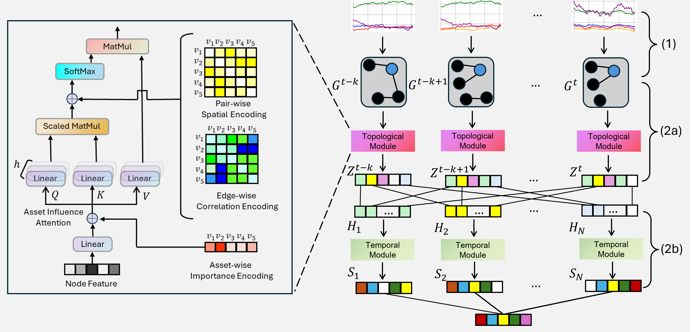

# DySTAGE: Dynamic Graph Representation Learning for Asset Pricing via Spatio-Temporal Attention and Graph Encodings

[[paper](https://dl.acm.org/doi/pdf/10.1145/3677052.3698680)] [[slides](./assets/DySTAGE_slides.pdf)]




DySTAGE is a novel dynamic graph representation learning framework designed to enhance asset pricing prediction by capturing the evolving interrelationships among financial assets. Unlike traditional models that rely on static graphs or time series data, DySTAGE employs dynamic graph structures to represent the temporal and spatial dependencies of assets in financial networks. This enables the model to adapt to changes in asset composition and their correlations over time.

## News
- [2024/10] 🔥 **Our DySTAGE paper is accepted by [ICAIF 2024](https://dl.acm.org/doi/proceedings/10.1145/3677052)**.

## Key Features
- **Dynamic Graph Construction**: The framework dynamically constructs graphs from time series data to reflect the evolving asset interrelationships, accommodating asset additions and removals over time.
- **Spatio-Temporal Attention**: DySTAGE employs a combination of spatial and temporal attention mechanisms to capture both the topological (structural) and temporal (historical) patterns of asset behavior.
- **Graph Encodings**: Utilizes financial insights to design graph encodings that improve model performance, including importance, spatial, and edge correlation encodings.
- **Performance Optimization**: Demonstrates superior predictive accuracy and portfolio management outcomes over popular benchmarks, offering profitable investment strategies based on asset price prediction.

## Installation

First, ensure you have the required dependencies. You can install them using the command below:
```
pip install -r requirements.txt
```

## Data Preparation

Due to confidentiality, we cannot provide the dataset used in our paper. However, you can prepare your data using the following structure. Store the prepared files in `data/{data_name}/` as specified:

- **graph.pkl**: A list of tensors representing the adjacency matrix of graph at each time step. Each matrix has a shape of `(N, N)`, where `N` is the total number of nodes/assets. The element of the matrix is the pearson correlation of excess return between two assets, calculated over past 36 months for monthly data or 61 trading days for daily data.
  - If the node does not exist in a particular time step, all its connections are set to `0`.
- **features.pkl**: A historical list of feature matrices, each of size `(N, F)`, where `F` is the feature dimension. Each feature matrix is stored in csr matrix.     - For non-existent nodes, features are set to `0` at the respective time step.
- **edge_feat.pkl**: A historical list of multi-scale edge attributes, each of size `(N, N, scale)`, where `scale` is the number of scales, 
- **shortest_path.pt**: A torch sensor in the shape of `(N, N, N)`, representing the shortest path between all pairs of nodes across the graph.

### Example Data Structure
Your folder structure should look like this:
```
data/
    {data_name}/
        graph.pkl
        features.pkl
        edge_feat.pkl
        shortest_path.pt
```

## Training
To train DySTAGE, run the following command:
```
python main.py --dataset {data_folder_name}
```
During training, the best model along with predictions and labels will be saved to the `result` directory.

## Citation
If you find this project is helpful to your research, please consider to cite our paper:
```
@inproceedings{gu2024dystage,
  title={DySTAGE: Dynamic Graph Representation Learning for Asset Pricing via Spatio-Temporal Attention and Graph Encodings},
  author={Gu, Jingyi and Ye, Junyi and Uddin, Ajim and Wang, Guiling},
  booktitle={Proceedings of the 5th ACM International Conference on AI in Finance},
  pages={388--396},
  year={2024}
}
```
